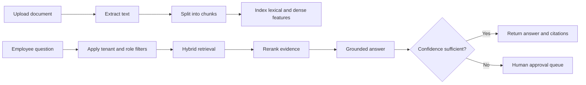
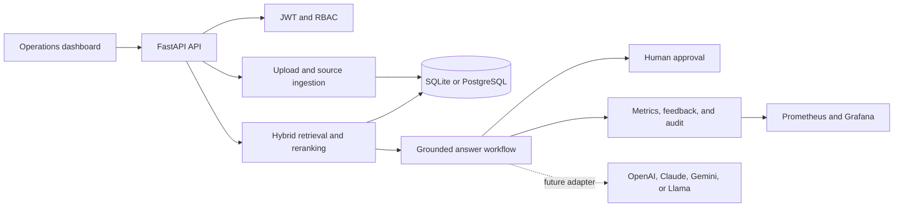

# OpsPilot - Enterprise AI Operations Platform

OpsPilot is a secure internal knowledge assistant for companies. Employees can upload
policies, procedures, handbooks, and operational documents, then ask questions in
normal language. OpsPilot searches the authorized knowledge base, produces a grounded
answer, cites its sources, calculates confidence, and routes uncertain answers to a
human reviewer.

This is more than a chatbot. It demonstrates the system surrounding enterprise AI:
ingestion, retrieval, permissions, approvals, feedback, auditability, observability,
source synchronization, testing, and deployment design.

## Example

Upload a policy containing:

> International remote work requires approval from the department director, People
> Operations, and Information Security.

Then ask:

> Who must approve international remote work?

OpsPilot retrieves the relevant policy section, answers using that evidence, displays
a confidence score, and cites the uploaded document.

## Current features

- FastAPI backend and interactive API documentation
- JWT authentication
- Admin, analyst, and viewer roles
- Tenant-isolated documents and queries
- PDF, Word, text, Markdown, CSV, and JSON uploads
- Multiple-file upload with a 10 MB limit per file
- Text extraction, chunking, indexing, and metadata classification
- BM25-style lexical retrieval plus deterministic dense vectors
- Retrieval reranking and grounded extractive answers
- Source citations and confidence scoring
- Low-confidence human approval queue
- Feedback collection and audit logs
- PII masking for email addresses, phone numbers, and SSNs
- Latency, cost, confidence, and activity dashboard
- Prometheus metrics endpoint
- Signed real-time connector event pipeline
- Idempotent source updates and deletions
- Connector checkpoints and role-based document filtering
- Five-document sample company knowledge base
- SQLite local mode and PostgreSQL-ready SQLAlchemy models
- Docker Compose, Kubernetes starter manifest, and GitHub Actions CI

The local answer engine is deterministic and does not require a paid AI key. OpenAI,
Claude, Gemini, or a local Llama model can later replace it through a provider adapter.

## Current limitations

The Sources screen supports normalized connector events for Slack, Google Drive,
SharePoint, Notion, Jira, Zendesk, Confluence, and email, but it does **not** yet log
in to those services directly.

The current connector API can receive authenticated source events. Direct provider
integration still requires:

- Provider-specific OAuth applications and credentials
- Initial backfill adapters
- Permission and membership synchronization
- Public HTTPS webhook endpoints
- Scheduled synchronization workers

Redis, Celery, pgvector, LangGraph, Langfuse, RAGAS, and DeepEval belong to the
production roadmap; they are not all active in the local MVP.

## Project structure

```text
project 1/
|-- app/
|   |-- main.py             FastAPI routes and application lifecycle
|   |-- models.py           Database models
|   |-- schemas.py          API request and response validation
|   |-- security.py         JWT authentication and role checks
|   |-- retrieval.py        Chunking, lexical search, vectors, and reranking
|   |-- workflow.py         Grounded answer and confidence workflow
|   |-- ingestion.py        PDF, Word, text, CSV, and JSON extraction
|   |-- connectors.py       Signed real-time source event pipeline
|   |-- metrics.py          Prometheus metrics
|   |-- sample_data/        Sample company policies
|   `-- static/             Dashboard HTML, CSS, and JavaScript
|-- tests/                  API and integration tests
|-- sample_uploads/         Ready-to-upload demonstration document
|-- infra/                  Prometheus and Kubernetes configuration
|-- Dockerfile
|-- docker-compose.yml
|-- pyproject.toml
`-- README.md
```

## Requirements

- Python 3.11 or newer
- A modern web browser
- Docker Desktop is optional

## Run on Windows

Open PowerShell inside the project folder:

```powershell
cd "C:\Users\kuche\OneDrive\Documents\project 1"
```

Create and activate a virtual environment:

```powershell
py -m venv .venv
.\.venv\Scripts\Activate.ps1
```

Install the application:

```powershell
python -m pip install -e ".[dev]"
```

Start the server:

```powershell
python -m uvicorn app.main:app --reload
```

If Python is not installed globally in the current Codex environment, use:

```powershell
C:\Users\kuche\.cache\codex-runtimes\codex-primary-runtime\dependencies\python\python.exe -m uvicorn app.main:app --reload
```

Open:

<http://localhost:8000>

API documentation is available at:

<http://localhost:8000/docs>

## Demo accounts

| Role | Email | Password | Main capabilities |
|---|---|---|---|
| Admin | `admin@opspilot.dev` | `admin123!` | Everything, including approvals and sources |
| Analyst | `analyst@opspilot.dev` | `analyst123!` | Query and ingest documents |
| Viewer | `viewer@opspilot.dev` | `viewer123!` | Query authorized knowledge |

These credentials are only for local development.

## First demonstration

### Option A: load the sample database

1. Sign in as the admin.
2. Open **Knowledge Base**.
3. Select **Load sample database**.
4. Wait for the success message.
5. Open **Knowledge Agent**.

Try:

```text
How many remote days are employees allowed?
```

```text
Who approves purchases above $25,000?
```

```text
When must an expense report be submitted?
```

```text
What should an employee do after receiving a suspected phishing message?
```

### Option B: upload the included Word document

Use:

```text
sample_uploads/Acme_Hybrid_Work_and_Equipment_Policy.docx
```

1. Open **Knowledge Base**.
2. Select **Upload files**.
3. Select the Word document.
4. Choose **Internal**.
5. Select **Upload and index**.
6. Open **Knowledge Agent**.

Try:

```text
How much is the annual home-office allowance?
```

Expected answer: `800 dollars`.

```text
Who must approve international remote work?
```

Expected answer: the department director, People Operations, and Information Security.

```text
How quickly must a lost company device be reported?
```

Expected answer: within one hour.

## How retrieval works



The development vector implementation uses deterministic feature hashing. This keeps
the demo free and reproducible. A production deployment should replace it with real
embedding models and pgvector or another vector database.

## Real-time connector simulation

Create a source from **Sources**. OpsPilot displays:

- A connection ID
- A webhook URL
- A one-time webhook secret

The secret authenticates events sent to OpsPilot. It is not a Google, Slack, or
Microsoft password.

Example PowerShell event:

```powershell
$connectionId = "REPLACE_WITH_CONNECTION_ID"
$connectorSecret = "REPLACE_WITH_ONE_TIME_SECRET"

$headers = @{
    "X-Connector-Secret" = $connectorSecret
}

$body = @{
    event_id = "demo-event-001"
    operation = "upsert"
    external_id = "source-item-001"
    title = "Remote Work Announcement"
    content = "Employees may work remotely three days per week."
    allowed_roles = @("admin", "analyst")
    metadata = @{
        channel = "company-announcements"
    }
} | ConvertTo-Json -Depth 5

Invoke-RestMethod `
    -Method Post `
    -Uri "http://localhost:8000/api/connectors/$connectionId/events" `
    -Headers $headers `
    -ContentType "application/json" `
    -Body $body
```

Expected result:

```text
status
------
upsert
```

Sending the same `event_id` again returns `duplicate`. Sending an event with
`operation = "delete"` removes the corresponding indexed source item.

Never commit connector secrets or OAuth credentials. Secrets exposed in screenshots,
chat messages, or logs should be rotated before using real data.

## Architecture



## Main API endpoints

| Method | Endpoint | Purpose |
|---|---|---|
| POST | `/api/auth/login` | Obtain a JWT |
| GET | `/api/auth/me` | Return the current user |
| GET | `/api/documents` | List authorized knowledge documents |
| POST | `/api/documents` | Ingest pasted text |
| POST | `/api/documents/upload` | Upload and extract files |
| POST | `/api/demo/load-sample-data` | Load the sample knowledge pack |
| POST | `/api/query` | Search and answer a question |
| GET | `/api/approvals` | List pending reviews |
| POST | `/api/approvals/{id}/decision` | Approve or reject a response |
| POST | `/api/feedback` | Record an answer rating |
| GET | `/api/dashboard` | Return operational metrics |
| GET | `/api/audit` | Return tenant audit events |
| GET | `/api/connectors` | List source connections |
| POST | `/api/connectors` | Create a source connection |
| POST | `/api/connectors/{id}/events` | Receive a signed source event |
| GET | `/metrics` | Prometheus metrics |
| GET | `/health` | Health check |

## Run automated tests

```powershell
python -m pytest -q
```

Expected:

```text
8 passed
```

Run lint:

```powershell
python -m ruff check app tests
```

## Docker

Start the infrastructure:

```powershell
docker compose up --build
```

Services:

- OpsPilot API: <http://localhost:8000>
- Grafana: <http://localhost:3000>
- Prometheus: <http://localhost:9090>
- PostgreSQL with pgvector
- Redis

The local application currently performs ingestion synchronously. A production Celery
worker remains a roadmap item.

## Security design

- Passwords are hashed using Argon2.
- API sessions use signed JWTs.
- Administrative operations require explicit roles.
- Documents and queries are isolated by tenant.
- Connector secrets are stored as hashes.
- Connector events support role restrictions.
- PII patterns are masked before answers are returned.
- Audit events record important actions.
- Low-confidence answers can require human approval.

For production, add SSO, managed secret storage, encryption at rest, Alembic
migrations, per-user source ACL synchronization, rate limiting, CSRF protection for
OAuth flows, and a formal threat model.

## Production roadmap

1. Add direct Google Drive and Slack OAuth adapters.
2. Add Google Picker for narrow per-file Drive access.
3. Move ingestion and synchronization to Celery workers.
4. Replace local vectors with provider embeddings and pgvector HNSW indexes.
5. Add OCR for scanned PDFs and images.
6. Add LangGraph provider and tool-calling nodes.
7. Add Langfuse and OpenTelemetry distributed traces.
8. Add RAGAS and DeepEval benchmark suites.
9. Add SAML/OIDC SSO and synchronized source ACLs.
10. Deploy the API and workers using Kubernetes.

## Interview explanation

> OpsPilot is a multi-tenant enterprise knowledge platform that ingests company
> documents and source events, performs permission-aware hybrid retrieval, and
> produces grounded answers with citations. It adds the operational controls needed
> around enterprise AI, including RBAC, human approval, audit logs, feedback,
> observability, and idempotent real-time synchronization.

Be clear that direct provider OAuth is still part of the roadmap. The normalized
connector pipeline is implemented and tested, while external vendor authentication
requires registered applications and real credentials.

## Resume bullet

> Built an enterprise AI operations platform with multi-tenant document ingestion,
> hybrid retrieval, grounded answers, citations, human approval, RBAC, audit logging,
> real-time connector events, and observability dashboards using FastAPI, SQLAlchemy,
> Docker, PostgreSQL, and Prometheus.

Only claim a quantified improvement such as "reduced search time by 70%" after running
and documenting a real benchmark.

## License

This repository is currently intended as a portfolio and learning project. Add an
explicit open-source license before distributing or accepting external contributions.
